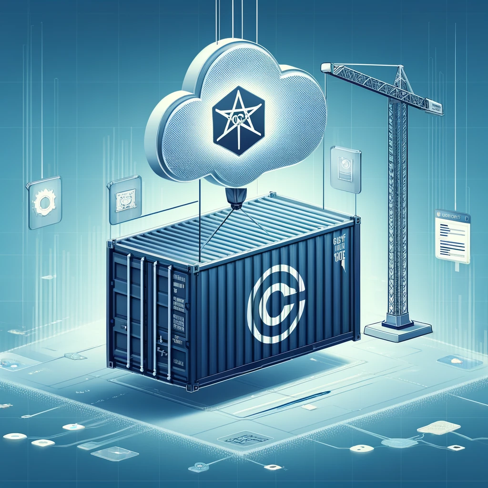
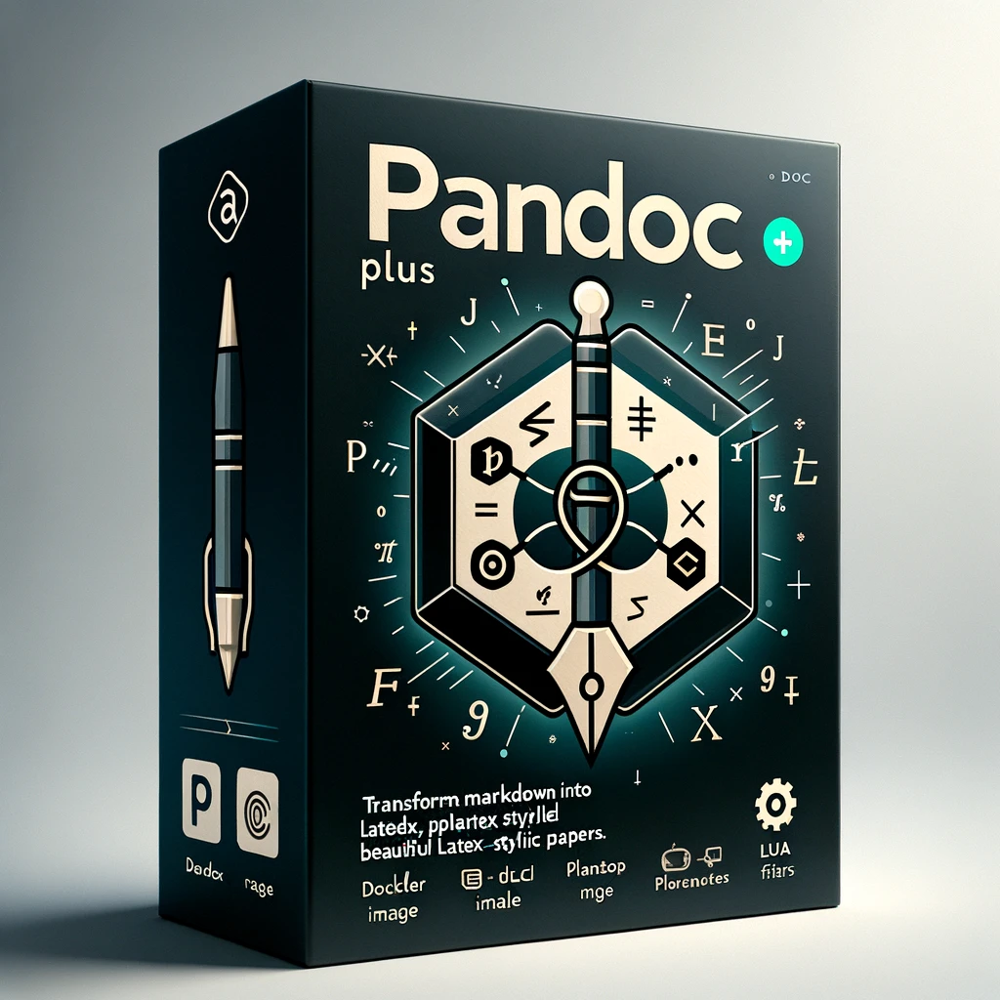
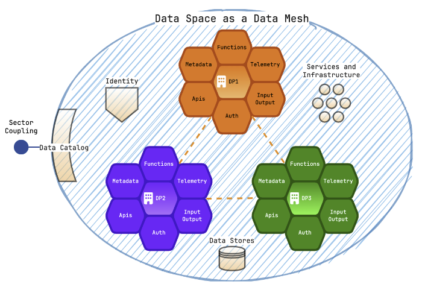
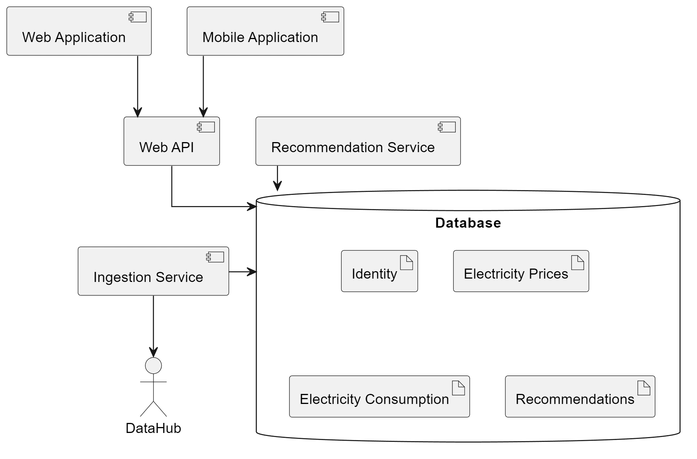
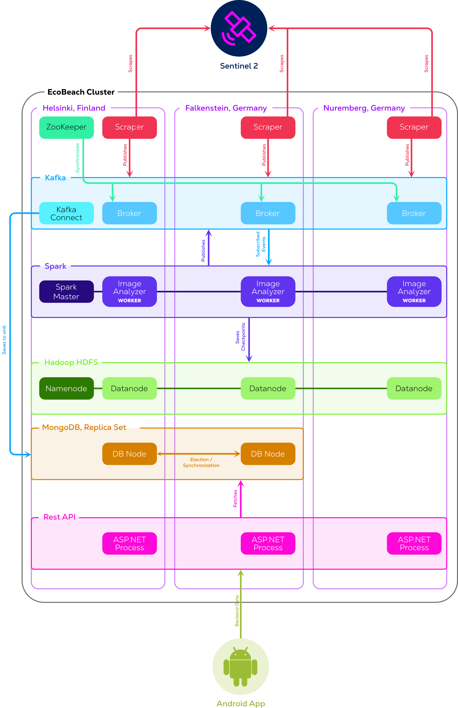
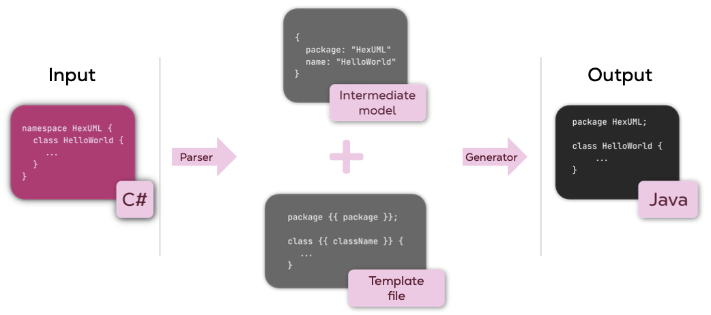

<iframe src="https://github.com/sponsors/devantler/button" title="Sponsor devantler" height="32" width="114" style="border: 0; border-radius: 6px;"></iframe>

## 🔨 Active Projects

These are the projects I am currently working on, and I am actively maintaining and developing them. I am always looking for contributors and feedback, so feel free to reach out if you are interested in contributing or have feedback on the projects. You can do so by visiting the projects GitHub page and following the contribution guidelines.

### [🛥️🐳 KSail](https://github.com/devantler/ksail)   

```txt
❯ ksail
🛥️ 🐳    Welcome to KSail!    🛥️ 🐳
                                     . . .
                __/___                 :
          _____/______|             ___|____     |"\/"|
  _______/_____\_______\_____     ,'        `.    \  /
  \               KSail      |    |  ^        \___/  |
~^~^~^~^~^~^~^~^~^~^~^~^~^~^~^~^~^~^~^~^~^~^~^~^~^~^~^~^~^
Description:
  KSail is a CLI tool for provisioning GitOps enabled K8s clusters in Docker.

Usage:
  ksail [command] [options]

Options:
  --version       Show version information
  -?, -h, --help  Show help and usage information

Commands:
  init <clusterName>    Initialize a new K8s cluster
  up <clusterName>      Provision a K8s cluster
  start <clusterName>   Start a K8s cluster
  update <clusterName>  Update manifests in an OCI registry
  stop <clusterName>    Stop a K8s cluster
  down <clusterName>    Destroy a K8s cluster
  list                  List running clusters
  lint <clusterName>    Lint manifest files
  check <clusterName>   Check the status of the cluster
  sops <clusterName>    Manage SOPS key
```

A CLI tool for provisioning GitOps-enabled K8s clusters in Docker. It is especially useful for local development and in CI pipelines.

Locally it allows you to spin up a K8s cluster with GitOps enabled to instantly deploy your Flux Kustomizations. This enables you to develop and test your applications in a K8s environment almost instantly.

In CI pipelines, it allows you to spin up a K8s cluster with GitOps enabled and test that it successfully deploys your applications.

### [#️⃣ .NET Commons](https://github.com/devantler/dotnet-commons) 


Various .NET libraries I built to simplify common tasks I encounter in my day-to-day work. The libraries are built to be as simple as possible to use, and often wrap more complex libraries to simplify common use cases in .NET. As such, they are not as flexible as the libraries they wrap, but they are much easier to use.

As I encounter more complex use cases, these libraries will grow in complexity, but I will always strive to keep them as simple as possible without solving something that has already been solved.

I use and maintain these libraries regularly, but I really appreciate contributions and feedback to find out whether they can be useful to others.

### [🏠 Homelab](https://github.com/devantler/homelab)    (WIP)


A Flux GitOps-based Kubernetes cluster that I run on a Mac Mini and a set of RPIs in my home. It demonstrates a dev-friendly approach to working with Kubernetes.

I use this cluster to learn and experiment with new technologies and approaches to working with Kubernetes. As such I strive to implement the latest and greatest technologies to keep my skills sharp and up-to-date.

I also plan to use this cluster to run services that I use in my day-to-day life, for entertainment, personal projects, or self-hosted services to cut costs and own my own data.

### [🚚 OCI Artifacts](https://github.com/devantler/oci-artifacts)   (WIP)



A spin-off project from my Homelab project, that simplifies my GitOps deployments by distributing my Kustomize and Flux HelmRelease components through OCI. Doing this allows me to deploy my applications in a single line of code, and still have the flexibility of regular Kustomize and Helm charts. The approach was inspired by shared libraries in regular programming languages, and I felt that Helm charts and Kustomize components required way too much duplication of code when deploying in multiple environments.

Most of the OCI Artifacts are dependent on Flux Kustomizations, and they use Flux Post Build Variables to injects values into the components. This allows me to expose values for the component, that a user can provide when deploying the component in typical settings.

I strive to keep the OCI Artifacts as simple as possible, such that they are very close to the original Kustomize and Helm charts default values. But in many cases, Helm Chart maintainers do not provide default values that enable the component to be deployed out-of-the-box. In those cases, I enforce some post-build variables to be set to ensure that the component can be deployed.

## 🔨 Inactive Projects

These projects are no longer actively maintained, but I still think they are interesting, and I would love to pick them up again if I find the time or opportunity to do so.

### [⬡ Data Product](https://github.com/devantler/data-product) 


My master thesis project, where I built a data product inspired by the Data Mesh architectural pattern, and the Data Product concept from the book "Data Mesh: Delivering Data-Driven Value at Scale" by Zhamak Dehghani. The project is built in .NET and uses a .NETs Source Generators to generate the data product based on its schema, and a YAML configuration file for the data product. As such, users were able to define their data product in a YAML file, and reference their schema to generate a data product with support for REST, GrapQL, Streaming, Observability, and more out-of-the-box.

The project was build as a containerized application, such that it can be deployed to various container orchestrators, and it was built according to many of the best practices I have learnt to appreciate from my interest in CNCF projects.

If you are interested in reading my thesis, you can find it [here](assets/pdfs/thesis.pdf).

### [✍🏻 Pandoc Plus](https://github.com/devantler/pandoc-plus)  



A docker image that packages pandoc with LaTeX, PlantUML, and lua filters, to create LaTeX-styled scientific papers with Markdown. The image is built to include all the necessary batteries to create high-quality scientific papers, supporting the most common features of LaTeX, with a simple Markdown syntax. Pandoc Plus also supports beautiful transformations of all Markdown syntax, such that transpiles to good LaTeX practices, and results in a beautiful PDF. It being a docker image, also makes it trivial to use in CI pipelines, to ensure your scientific papers compile correctly, and that you can easily share your work with others. This essentially allows you to write your scientific papers in accordance with best practices in software development, saving you lots of time and effort.

Pandoc Plus was developed as a side project to my master thesis, which was also a compiled by Pandoc Plus. If you are interested in seeing the output of Pandoc Plus, and how the projects source code is structured, you can find my Master Thesis [here](assets/pdfs/thesis.pdf).

## ✅ Completed Projects

These are projects that I have completed, and that I am no longer actively maintaining. These are projects that for one or another reason have a stopping point, as they were projects built for a specific purpose that does not require maintenance, or because I have actively abandoned them.

### [🤖 Star Wars Site](https://github.com/devantler/star-wars-site)   

A Star Wars site I built as part of a hirement process at Umbraco, where I was tasked with building a site that showcased my skills in .NET and Umbraco. The site is built as a Blazor WebAssembly application, that fetches data from Umbraco Heartcore, and displays it in a Star Wars themes site. The site is built to be responsive and to be as fast as possible, and it uses a lot of the latest and greatest technologies in .NET and Umbraco. To make the project a bit more interesting I decided to deploy the site to a Nomad cluster, as this was a technology I was interested in learning more about at the time. Nomad was a great container orchestrator, but I found it to be a bit too underappreciated in the industry, hence I now use Kubernetes for most of my projects, as it is more widely adopted.

The site is no longer maintained, as it was connected to an Umbraco Heartcore instance that was only available during the hirement process. But the source code is still available!

## 🎓 School Projects at the University of Southern Denmark

These are projects I have completed during my time at the University of Southern Denmark. They are projects that I am proud of, and that I think showcase my skills and dedication to learn and explore new technologies and approaches to solving software engineering problems.

### 🌏 Exploration of state-of-the-art technology, architectures and tools to create future-proof data spaces <span style="float:right">10th semester (MSc)</span>



⭐️ Graded 12/12

An exploration of whether a data space can be implemented as a data mesh, focusing on challenges and potential benefits for collaboration among actors in the Danish energy sector. The study employs constructivism and the constructive research approach as its methodology, utilizing the grounded theory method to conduct fieldwork and create theories and hypotheses from the results. The research encompasses topics such as the climate, the Danish energy sector, data spaces, and data mesh, emphasizing a prototype of a data mesh’s central component, a data product. The prototype demonstrates that the data mesh approach can be successfully applied to data spaces, enabling better separation of domains within sectors and enabling discoverability, observability, and governance. However, it lacks the features and the maturity to provide a production-ready and complete solution. Overall, this thesis contributes to the ongoing discussion on future-proof data spaces and provides insights into implementing a data space as a data mesh to achieve that goal.

If you are interested in reading my thesis, you can find it [here](assets/pdfs/thesis.pdf).

### 📊 Power Price Assistant <span style="float:right">9th semester</span>



⭐️ Graded 12/12

A web app that simulates a system that can advise on what electricity provider to choose based on the user's electricity consumption patterns, and priorities.

### 🏗️ Simulated Assembly Line <span style="float:right">8th semester</span>

<video width="640" height=" 360" controls>
  <source src="assets/videos/simulated-assembly-line.mp4" type="video/mp4">
</video>

⭐️ Graded 10/12

A simulated assembly line consisting of a self-constructed crane, a rotating disk, and a web camera. It was programmed by the group's own Domain-Specific Language (DSL), which generated a client that could execute the program. The client utilized MQTT to communicate with the embedded system.

### 🌊 EcoBeach <span style="float:right">7th semester</span>



⭐️ Graded 7/12

A big data system that scraped satellite imagery of beach geo-locations from the Sentinel-2 satellite and processed them to determine how shorelines have changed over time. An Android app was also built to visualize the data.

You can read the report [here](assets/pdfs/ecobeach.pdf)

### ⬣ HexUML <span style="float:right">6th semester (BSc)</span>



⭐️ Graded 12/12

A generic transpiler framework capable of translating one text source into another, e.g., from Java to C#. The framework was used to generate AnyLogic models for a web-based application (EcosystemMapGenerator), that I built for SDU during my hire as a student programmer at Maersk Mc-Kinney Moller Institute from February 2021 to November 2021.
