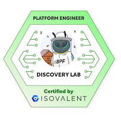

# Hi there 👋🏻


## About Me 📝

> **Name**: Nikolai Emil Damm 👨🏻
>
> **Alias**: devantler 🧑🏻‍💻
>
> **Nationality**: Danish 🇩🇰
>
> **Languages**: Danish, English 🌍
>
> **Location**: Kolding, Denmark 📍
>
> **Time Zone**: Central European Time (CET) ⏰
>
> **Pronouns**: He/Him ♂
>
> **Personal Interests**: Running, Gaming, Technology and Music 🏃🏻🎮📱🎧
>
> **Education**: MSc in Software Engineering 🎓
>
> **Occupation**: Software Developer 🧑🏻‍💻

As a software engineer, I have a strong passion for modern software development practices and technologies. I truly believe in the power of open-source software, especially its ability to spark innovation and encourage collaboration. I'm a big fan of the Cloud Native Computing Foundation (CNCF) and appreciate their work in promoting the use of cloud-native technologies. I believe that by working together on important software, we can tackle the challenges we face today and in the future.

```csharp
public class DevProfile {
  public FavLang FavLang { get; set; } = FavLang.CSharp;
  public string[] Skills { get; set; } = {
    "C#/.NET",
    "Go",
    "K8s",
    "Docker",
    "Infrastructure as Code",
    "CNCF Tools and Technologies",
    "And much much more"
  };
  public string[] Interests { get; set; } = {
    "Modern approaches to bridge OT and IT",
    "Simplifying Software Development and Operations",
    "Making Software Development Fun and Enjoyable",
    "Incorparating User Feedback early and often",
    "Testing Everything",
    "Automating Everything",
    "Sharing Knowledge through Open Source",
    "Advocating 'X as Code' approaches",
    "Building on top of the shoulders of giants"
  };
}
```

## Professional Experience 💼

Years of experience in software development have given me a solid foundation in modern software development practices and technologies. I have worked on a wide range of projects, from developing and maintaining e-commerce platforms to creating and operating cloud-native solutions. I have a strong passion for learning and sharing knowledge, and I'm always looking for new challenges and opportunities to grow as a software developer. I have a sharp eye for detail and a strong focus on quality and simplicity in everything I do.

### Software Developer <span style="float:right">August 2023 - Present</span>

_Energinet, Fredericia_

Working as a software developer at Energinet, I'm part of the Substation Data team born from the Digital Incubator in the Innovation department. The Digital Incubator is responsible for developing and maintaining software solutions that have been identified as strategic and innovative for the organization. Furthermore, the team is very focused on adopting modern software development practices and technologies, while promoting a culture that encourages learning and sharing knowledge across the organization. As a member of the Substation Data team my primary focus is on platform engineering and IT/OT convergence.

- Developing and maintaining K8s infrastructure and platforms.
- Developing and maintaining GitOps tooling.
- Developing and maintaining CI/CD pipelines.
- Developing and maintaining IT and OT integrations.
- Supporting the organization in adopting modern software development practices like GitOps, DevOps, and cloud-native.
- Community work to support the organization in becoming more aware of inner an open source benefits.

### Teaching Assistant <span style="float:right">September 2022 - August 2023</span>

_University of Southern Denmark, Odense_

Working as a teaching assistant in Big Data at the University of Southern Denmark, I was part of the teaching team for the Big Data course. I was responsible for creating course material, teaching students, and helping students with their exercises. The course was focused on teaching students how to work with big data and how to use big data technologies to solve real-world problems like handling large amounts of data, analyzing data, and visualizing data.

- Creating course material.
- Teaching students.
- Helping students with their exercises.

### Student Software Developer <span style="float:right">July 2022 - August 2023</span>

_Umbraco, Odense_

Working as a student software developer at Umbraco, I was part of the Umbraco Heartcore team. The team is responsible for developing and maintaining the Umbraco Heartcore headless CMS. The team is very focused on building a good user experience for Umbraco Heartcore users, while ensuring that the product is reliable and scalable.

- Developing and maintaining the Umbraco Heartcore Product.
- Working with operation of the Umbraco Heartcore Product in Azure Portal.
- Working with Infrastructure as Code (IaC) with Terraform.
- Working with CI/CD pipelines in Azure DevOps.
- Working in a DevOps team with a focus on automation and monitoring.

### Student Software Developer <span style="float:right">November 2021 - July 2022</span>

_FiftyTwo, Kolding_

Working as a student software developer at FiftyTwo, I was part of the development team for an e-commerce platform. The team was responsible for developing and maintaining the e-commerce platform, while ensuring that the platform was reliable and scalable. The team was focused on finding the right balance between maintaining a reliable platform and developing new features.

- Developing and maintaining the e-commerce platform.
- Working with .NET Framework and SVN.
- Working with SQL Server and Stored Procedures.
- Working with Kabana and Network Monitoring.

### Student Software Developer <span style="float:right">February 2021 - November 2021</span>

_Maersk Mc-Kinney Moller Institute, Odense_

Working as a student software developer at the Maersk Mc-Kinney Moller Institute, I was the sole developer of a platform that was used in research projects and course material to explore the possibilities of mapping and visualizing Business Ecosystems with UML. The platform was developed in C# and Blazor WebAssembly and was used to create and visualize Business Ecosystems with a UML editor. Students and researchers were able to create user accounts and manage their Business Ecosystems in the platform.

- Developing and operating a web-based platform.
- Working with C# and Blazor WebAssembly.
- Working with SQL Server and Entity Framework.
- Working with Azure and GitHub Actions.
- Working with Actor-Based modeling and UML.
- Working closely with researchers and students.
- Working alone on a project from start to finish.

### Teaching Assistant <span style="float:right">September 2020 - December 2020</span>

_University of Southern Denmark, Odense_

Working as a teaching assistant in Object-Oriented Programming at the University of Southern Denmark, I was part of the teaching team for the Object-Oriented Programming course. I was responsible for creating course material, teaching students, and helping students with their exercises. The course was focused on teaching new students the core principles of object-oriented programming and how to code in Java.

- Creating course material.
- Teaching students.
- Helping students with their exercises.

### Student Software Developer <span style="float:right">February 2018 - May 2019</span>

_GF Forsikring, Odense_

Working as a student software developer at GF Forsikring, I was part of the development team for the GF Forsikring website and landing pages. The team was responsible for developing and maintaining the sites in Sitecore. The team was focused on creating a good user experience for GF Forsikring customers, while ensuring that the sites were reliable.

- Developing and maintaining the GF Forsikring website and landing pages.
- Working with Sitecore, Git and SVN.
- Working with AngularJS and many other front-end technologies.
- Working with SQL Server.
- Working with the Marketing team to quickly create landing pages for campaigns.

## Achievements

- [Credly Badges](https://www.credly.com/users/nikolai-emil-damm/badges)



## [Projects 📽️](https://devantler.com/projects)

| Project Name                                                   | Description                                                                                                                                                                       | State   |
| -------------------------------------------------------------- | --------------------------------------------------------------------------------------------------------------------------------------------------------------------------------- | ------- |
| [🛥️🐳 KSail](https://github.com/devantler/ksail)               | A CLI tool for provisioning GitOps-enabled K8s clusters in Docker.                                                                                                                | Active  |
| [🏠 Homelab](https://github.com/devantler/homelab)             | A Flux GitOps-based Kubernetes cluster that I run on a Mac Mini and a set of RPIs in my home. It demonstrates a dev-friendly approach to working with Kubernetes.                 | Active  |
| [🚚 OCI Artifacts](https://github.com/devantler/oci-artifacts) | Popular Kustomize and Flux HelmRelease components that are distributed through OCI.                                                                                               | Active  |
| [⬡ Data Product](https://github.com/devantler/data-product)    | A data product inspired by the Data Mesh architectural pattern, and the Data Product concept from the book "Data Mesh: Delivering Data-Driven Value at Scale" by Zhamak Dehghani. | On Hold |
| [✍🏻 Pandoc Plus](https://github.com/devantler/pandoc-plus)     | A docker image that packages pandoc with LaTeX, PlantUML, and lua filters, to create LaTeX styled scientific papers with Markdown.                                                | On Hold |

## [Libraries 📦](https://devantler.com/libraries)

| Library Name                                                                             | Description                                                          | State          |
| ---------------------------------------------------------------------------------------- | -------------------------------------------------------------------- | -------------- |
| [🔑 .NET Age CLI](https://github.com/devantler/dotnet-age-cli)                           | A simple .NET library that embeds the Age CLI.                       | In development |
| [🔁 .NET Flux CLI](https://github.com/devantler/dotnet-flux-cli)                         | A simple .NET library that embeds the Flux CLI.                      | In development |
| [③ .NET K3d CLI](https://github.com/devantler/dotnet-k3d-cli)                            | A simple .NET library that embeds the K3d CLI.                       | In development |
| [🐶 .NET K9s CLI](https://github.com/devantler/dotnet-k9s-cli)                           | A simple .NET library that embeds the K9s CLI.                       | In development |
| [⚗️ .NET Kind CLI](https://github.com/devantler/dotnet-kind-cli)                         | A simple .NET library that embeds the Kind CLI.                      | In development |
| [🔎 .NET Kubeconform CLI](https://github.com/devantler/dotnet-kubeconform-cli)           | A simple .NET library that embeds the Kubeconform CLI.               | In development |
| [Ⓚ .NET Kustomize CLI](https://github.com/devantler/dotnet-kustomize-cli)                | A simple .NET library that embeds the Kustomize CLI.                 | In development |
| [🔐 .NET SOPS CLI](https://github.com/devantler/dotnet-sops-cli)                         | A simple .NET library that embeds the SOPS CLI                       | In development |
| [📄 .NET Template Engine](https://github.com/devantler/dotnet-template-engine)           | A simple template engine for .NET.                                   | Active         |
| [☸️ .NET Kubernetes Generator](https://github.com/devantler/dotnet-kubernetes-generator) | A simple code generator that can generate Kubernetes manifest files. | In development |

## [Templates 📁](https://devantler.com/templates)

| Template Name                                                    | Description                              | State  |
| ---------------------------------------------------------------- | ---------------------------------------- | ------ |
| [#️⃣ .NET Template](https://github.com/devantler/dotnet-template) | A simple .NET template for new projects. | Active |

## Live Stats 📊

<div align="center">
  <a href="https://github.com/anuraghazra/github-readme-stats">
    
  </a>
  <a href="https://github.com/anuraghazra/github-readme-stats">
    
  </a>
</div>
